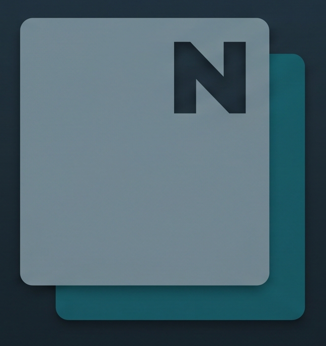

# Noterious

<p align="center">
  
</p>

Noterious is a server-first markdown notebook. Your notes stay as markdown files on disk, while the server handles indexing, queries, rendering, history, notifications, and the web UI.

## What It Does

- keeps markdown files as the source of truth
- serves a web UI for browsing, editing, tasks, backlinks, and embedded queries
- supports raw markdown, editable rendered notes, and a rendered view-only mode for selecting/copying from live query results without flipping back into edit state
- includes an optional server-managed AI copilot for drafting Noterious queries, including inline `/query ...` generation
- includes a built-in readonly Help page for markdown, properties, queries, slash commands, and shortcuts
- supports drag-and-drop and `/file` uploads, including inline image embeds for uploaded image assets, configurable upload placement, and unused-upload surfacing in the document picker
- builds a disposable SQLite index for fast search and query execution
- supports vault-native note templates under `_templates/`
- automatically merges non-overlapping concurrent page edits from multiple clients and falls back to explicit conflicts for overlapping changes
- sends notifications from both task reminders and note frontmatter notification fields
- supports one account per deployment
- supports API bearer tokens for automation clients (see [docs/api.md](docs/api.md))
- treats top-level folders under the vault root as switchable scopes in the UI
- supports built-in and custom UI themes
- ships Nix packaging plus a multi-instance NixOS module

## Android Apps

- [noterious-android](https://github.com/carnager/noterious-android) for the general Android client
- [noterious-shopping](https://github.com/carnager/noterious-shopping) for the shopping-focused Android companion

## Quick Start

Requirements:

- Go
- Node.js and npm

Install frontend dependencies:

```bash
npm install
```

Build the embedded UI:

```bash
npm run build:ui
```

Run the server:

```bash
go run ./cmd/noterious
```

Or build a binary first:

```bash
go build -o noterious ./cmd/noterious
./noterious
```

By default Noterious uses:

- vault root: `./vault`
- data dir: `./data`
- listen address: `:3000`

Open `http://localhost:3000`.

On first startup against an empty data directory:

- if `NOTERIOUS_AUTH_BOOTSTRAP_USERNAME` and `NOTERIOUS_AUTH_BOOTSTRAP_PASSWORD` are set, that account is created automatically
- otherwise the web UI starts in first-run setup mode and asks you to create the initial account

## Vault Model

Noterious has one configured vault root on disk.

That root is itself a valid note space:

- `<vault-root>`

Switchable scopes are just direct child folders below it:

- `<vault-root>/<top-level-folder>`

The UI always treats those top-level folders as scopes. This is a UI/runtime scope feature, not a separate storage backend.

Background services stay rooted at the configured vault root:

- the filesystem watcher polls the configured root
- the ntfy notifier polls the configured root index when it exists

Request-time page/task/query routes run against the currently selected vault scope for that session.

## Templates

Templates are regular markdown notes stored in `_templates/`.

- global templates live under `<vault-root>/_templates`
- scoped templates can also live under `<vault-root>/<top-level-folder>/_templates`
- creating a note from a template copies the template body and frontmatter scaffold
- the created note stays clean markdown; template metadata is not kept in the resulting note
- templates are created from the quick switcher via `Create <Template Name>`

Supported template metadata keys:

- `_template_label`
- `_template_folder`
- `_template_bool`
- `_template_date`
- `_template_datetime`
- `_template_notification`
- `_template_tags`
- `_template_list`

Example:

```md
---
_template_label: Contact
_template_folder: contacts
_template_date:
  - birthday
_template_bool:
  - birthday_reminder
_template_tags:
  - tags
vorname: ""
nachname: ""
birthday: ""
birthday_reminder: false
tags:
  - contact
---

## Notizen
```

For the full flow, including quick-switcher creation, placeholders, guided fill, and a complete contact example, see [docs/templates.md](docs/templates.md).

## Notifications

Noterious supports reminders in two places:

- task reminders via `[remind: YYYY-MM-DD HH:MM]`
- note frontmatter fields such as `notification`, `notify`, `remind`, `reminder`, or `*_notification`

For note frontmatter, `notification` is the dedicated datetime-like field kind in the UI. Optional sibling `*_click` fields are forwarded to ntfy as tap targets, so a notification can open a URL or app-specific URI when clicked. Task reminders can also carry an optional `[click: ...]` target. When no explicit click target is set, ntfy reminders default to `noterious://open?page=...`, which opens the matching page in the Noterious Android app.

Example:

```md
---
notification: 2026-05-01 09:00
notification_click: noteriousshopping://shopping
---
```

Task example:

```md
- [ ] Buy groceries [remind: 2026-05-01 17:30] [click: noteriousshopping://shopping]
```

Tasks can also repeat: `[repeat: weekly]` (or `daily`, `monthly`, `yearly`, `2d`, `3w`, `6m`, `1y`). Completing a repeating task keeps it open and advances its due/remind dates by the interval.

## AI Query Copilot

The Queries screen includes an optional AI copilot for drafting Noterious
queries from plain-language intent.

- it is configured server-side in `Settings -> AI`
- v1 supports one OpenAI-compatible endpoint at a time by `baseUrl + model`
- the API key is stored on the server and is never sent back to the browser
- the prompt is grounded in the query language docs plus the live query
  schema/capabilities/examples
- live note content, preview rows, and vault data are not sent to the model

This is intentionally query-only. It does not act as a general note-writing
assistant.

## Themes

Theme selection is browser-local.

- built-in themes ship with the app
- custom themes are uploaded through the settings modal
- uploaded theme files are stored on the server under `<data-dir>/themes`
- deleting a custom theme removes it from the shared server theme library

To create your own themes, see [docs/themes.md](docs/themes.md).

## Configuration

Useful environment variables:

- `NOTERIOUS_VAULT_PATH`
- `NOTERIOUS_DATA_DIR`
- `NOTERIOUS_LISTEN_ADDR`
- `NOTERIOUS_WATCH_INTERVAL`
- `NOTERIOUS_NTFY_INTERVAL`
- `NOTERIOUS_AUTH_COOKIE_NAME`
- `NOTERIOUS_AUTH_SESSION_TTL`
- `NOTERIOUS_AUTH_BOOTSTRAP_USERNAME`
- `NOTERIOUS_AUTH_BOOTSTRAP_PASSWORD`
- `NOTERIOUS_AUTH_BOOTSTRAP_PASSWORD_FILE`
- `NOTERIOUS_HISTORY_MAX_REVISIONS` (per page; `0` or unset keeps every revision)
- `NOTERIOUS_HISTORY_MAX_AGE` (e.g. `2160h` for 90 days; `0` or unset keeps every revision)

History retention is unlimited by default. When either limit is set, older
revisions are pruned on save; the newest revision of a page is always kept.

CLI flags currently support:

- `--listen-addr`
- `--port`
- `--data-dir`
- `--vault-dir`

CLI flags override the corresponding environment variables.

## Backups

For a real deployment backup, back up both:

- the vault root
- the data dir

The vault contains the notes and uploaded files. The data dir contains
server-managed state such as history, trash, custom themes, auth state, and
the SQLite index. The index is rebuildable, but the rest of the data-dir state
is not.

The settings modal also shows the resolved runtime backup paths and can:

- download a backup manifest JSON
- download a generated shell backup script for the current deployment
- validate a backup manifest against the current deployment paths before
  restoring

See [docs/backups.md](docs/backups.md) for the
full backup and restore guidance, and
[docs/operations.md](docs/operations.md) for
upgrade/restart/recovery guidance.

## Development

Rebuild the embedded UI after frontend changes:

```bash
npm run build:ui
```

Verify committed generated assets:

```bash
npm run verify:ui
```

The UI is served through Go `embed`, so after rebuilding the frontend you must restart the Go process to pick up the new files.

## Docs

- [docs/api.md](docs/api.md) for HTTP endpoints
- [docs/query-language.md](docs/query-language.md) for embedded query syntax
- [docs/architecture.md](docs/architecture.md) for runtime/storage structure
- [docs/backups.md](docs/backups.md) for deployment backup/restore guidance
- [docs/operations.md](docs/operations.md) for upgrade/restart/recovery guidance
- [docs/release-checklist.md](docs/release-checklist.md) for maintainer release steps
- [docs/templates.md](docs/templates.md) for vault-native note templates
- [docs/themes.md](docs/themes.md) for custom theme authoring

## Service Setup

The repository includes a user-level systemd unit at [contrib/systemd/noterious.service](contrib/systemd/noterious.service).

For packaged installs, enable it directly:

```bash
systemctl --user daemon-reload
systemctl --user enable --now noterious
```

For source installs, copy it to `~/.config/systemd/user/noterious.service`, adjust `ExecStart` and the path environment variables, then run:

```bash
systemctl --user daemon-reload
systemctl --user enable --now noterious
```

## Nix / NixOS

The repository now includes:

- a `flake.nix`
- a build package at [nix/package.nix](nix/package.nix)
- a NixOS module at [nix/module.nix](nix/module.nix)

When consuming Noterious as a flake input, the intended moving-release flow is the `latest` tag:

```nix
{
  inputs.noterious.url = "github:carnager/noterious/latest";
}
```

That tag is moved to the newest release tag. If you want a fixed release instead, pin the explicit version tag:

```nix
{
  inputs.noterious.url = "github:carnager/noterious/v0.1.27";
}
```

Inside the repository checkout itself, build the package directly with:

```bash
nix build .#noterious
```

To use the NixOS module, import `inputs.noterious.nixosModules.default` and configure one or more instances:

```nix
{
  imports = [ inputs.noterious.nixosModules.default ];

  services.noterious.instances = {
    main = {
      enable = true;
      port = 3000;
      vaultDir = "/srv/noterious/main/vault";
    };

    work = {
      enable = true;
      port = 3001;
      vaultDir = "/srv/noterious/work/vault";
      openFirewall = true;
    };
  };
}
```

Each enabled instance creates a systemd service named `noterious@<instance>.service`.
Bootstrap secrets can be provided through `services.noterious.instances.<name>.bootstrapPasswordFile`.

## Arch Linux

A release-oriented [PKGBUILD](PKGBUILD) is included at the repository root.

- it builds the embedded-server binary with Go
- it installs the user unit to `/usr/lib/systemd/user/noterious.service`
- it expects the release tarball to already include the generated frontend assets
